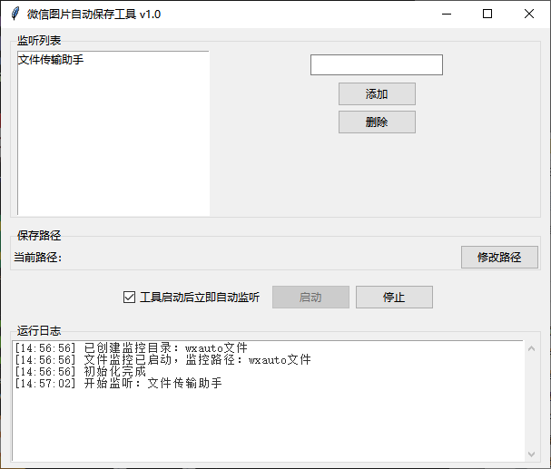

# 🚀 微信图片自动保存工具

 <!-- 后续可替换实际截图 -->

##简单介绍
- 我对于代码什么的其实完全是一知半解，开发这么个小工具纯粹是被wx的幽默机制干急眼了（）因为我专业是生物这块的，同学们经常在微信群里发实验细胞的图片，然后往往因为我没点开导致图片已过期（现在好像手机端点开了也会过期了），写实验报告的时候还得求爷爷告奶奶的问他们要图片，我也找过其他人的工具，但基本上要么不能保存原图，要么就是收费，也不知道为什么wx自己不搞自动下载图片的功能（恼）
- 由于我真的只是小菜鸡，这里面所有的代码都是基于ds（ds，超我的ai！）给出来的代码进行修改得到的，如果有大佬愿意帮忙完善那自然是最好的
- 目前已知有个小bug是会跟鼠标抢控制权，如果遇到了一般来说就重启工具就行了
- 不支持微信4.0以上的版本，因为wxauto没适配
- 还有，我的电脑是白天一直开机的，所以我基本上没考虑历史消息的情况，我也试过了获取历史消息，但是ds给的代码有点抽风，于是就放弃了。

## 📦 功能特性
- 实时监控并保存微信聊天图片
- 按联系人自动分类保存
- 支持自定义保存路径
- 低内存占用后台运行（但多开微信聊天窗口的内存会变高）

## 🛠️ 安装使用

### 直接运行（推荐）
1. 前往 [Releases](https://github.com/LF12306/WeChat-Image-Saver/releases) 下载最新版exe
2. 打开微信（不打开就无法接收）
3. 双击运行`微信图片自动保存工具.exe`

### 从源码运行
```bash
git clone https://github.com/LF12306/WeChat-Image-Saver.git
pip install -r requirements.txt
python 自动保存工具.py
⚙️ 配置说明
功能	         操作方法
添加监听对象	   输入联系人名称 → 点击添加
修改保存路径	   点击"修改路径"选择新位置

## ❓ 常见问题
### 无法检测到微信窗口？
1. 确保微信客户端已登录
2. 以管理员身份运行本程序

### 如何更新配置？
直接编辑`wx_config.json`或通过界面修改后会自动保存

### 为什么没开机自启动？
好问题，因为微信不能自启动（因为要打开到聊天界面，而不是打开到“进入微信”，还得手动点一下才能进入微信，我觉得这设计纯***），虽然我写了脚本能自启动微信，但很不稳定，于是就先把这个工具发出来。


## 🙏 致谢

特别感谢以下项目的开发者：
- [wxauto](https://github.com/cluic/wxauto) 提供了微信自动化控制的核心功能
